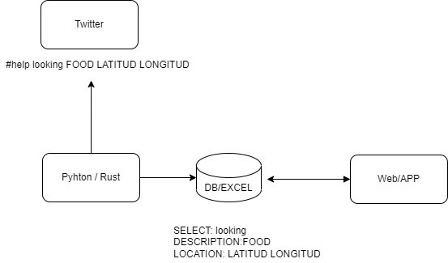

# Live help 

## General Architecture

There are two options to publish a request/offer for help: 

1. Twitter. Following the next protocol:

        #Livehelp [offering | looking] [description] [location]

   where:

    - description could be: FOOD, APARMENT
    - location is <latitud, longitud>. 

    For instance: 

    [#livehelp LOOKING FOOD 50.116467 30.636352](https://twitter.com/PlanInteraction/status/1507034642859315200?s=20&t=2ULWujSt5cbgTBKGvO8qHQ)

    A Python application is reading from all those message an store them in the database or excel file:
    
        MKR	SELECT          DESCRIPTION	DATE/TIME	LOCATION

2. Through the APP or Web application

The web application is the frontend of the application. Showing all the information stored in the database. 
